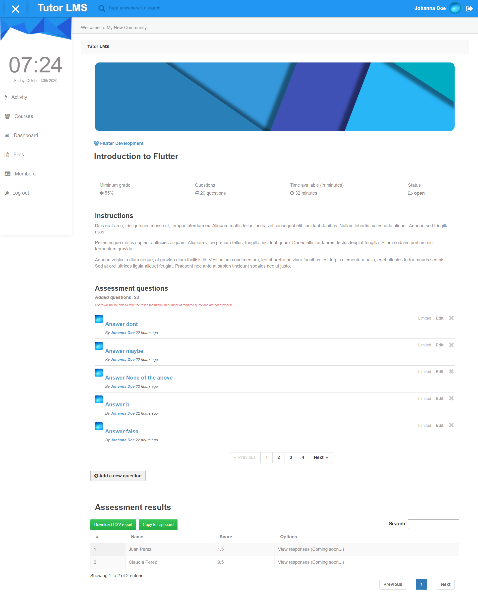

# Assessment plugin for Elgg

Create unlimited assessments with this elgg plugin. You will be able to offer in class assessments on any device, any question type, add images to a question, set up the time limit, passing grades, 
use timed/not timed assessments, grades reported back to the grade book, group assessment, view student responses in real time to offer in-class discussion about the results, and more!

## Getting Started

- Download or clone this repository/plugin
- Unzip it inside the mod folder
- Go to the plugins section, and activate it

## Features

- Outstanding design compatible with any theme
- Unlimited assessments
- Assessment Dashboard
- Easy question creator
- Grade report table
- Export grades to a CSV file
- Automated quiz results
- Compatible with Tutor LMS plugin

## To do

- View individual user responses
- Notify via email the results of the assessment to the user
- Edit questions and answers
- Add a timer to the assessment
- Add how many times a user can take an assessment
- Let users view their responses
- Random order of the questions
- Improve image support

